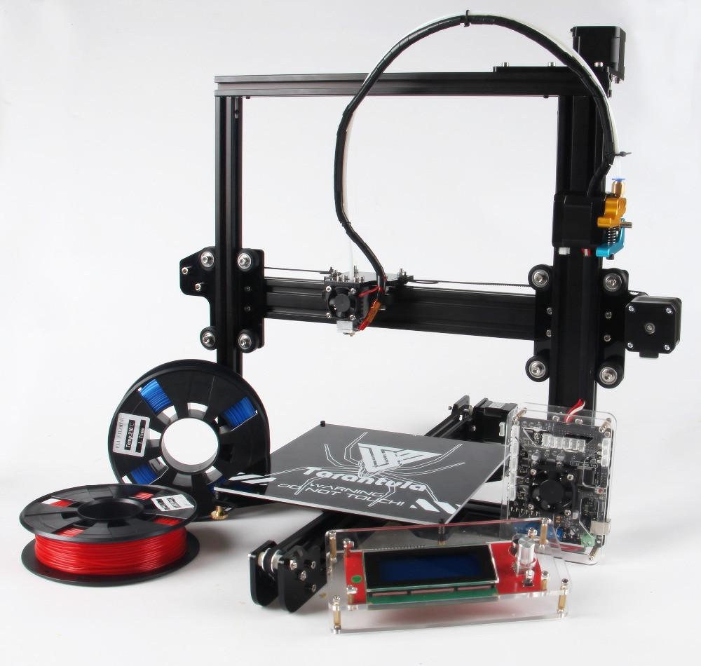
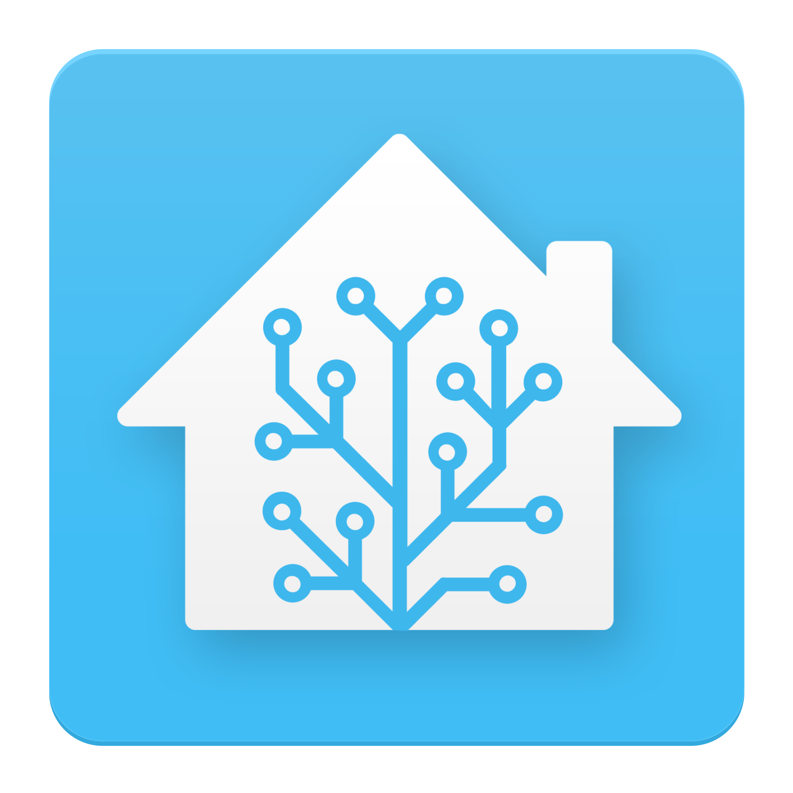

<!-- Main -->

<!-- One -->
<!-- <section id="one">
	

		<header class="major">
			<h2>Sed amet aliquam</h2>
		</header>
		
Nullam et orci eu lorem consequat tincidunt vivamus et sagittis magna sed nunc rhoncus condimentum sem. In efficitur ligula tate urna. Maecenas massa vel lacinia pellentesque lorem ipsum dolor. Nullam et orci eu lorem consequat tincidunt. Vivamus et sagittis libero. Nullam et orci eu lorem consequat tincidunt vivamus et sagittis magna sed nunc rhoncus condimentum sem. In efficitur ligula tate urna.

	

</section>
-->

<!-- Two -->
<section id="two" class="spotlights">
	<section>
		
		

			

				<header class="major">
					<h3>Home Built 3D-Printer</h3>
				</header>
				
Ever since my first 3D design class I wanted to get into 3D printed. After not being able to find a 3D printer to use I decided to build my own.

				<ul class="actions">
					<li><a href="/2018/05/20/vibrations.html" class="button">Check it out</a></li>
				</ul>
			

		

	</section>
	<section>
		
		

			

				<header class="major">
					<h3>Home Assistant</h3>
				</header>
				
Home Automation using Raspberry Pi.

				<ul class="actions">
					<li><a href="/2018/05/20/HA.html" class="button">Check it out</a></li>
				</ul>
			

		

	</section>
</section>

<!-- Three -->
<!--
<section id="three">
	

		<header class="major">
			<h2>Schoolwork</h2>
		</header>
		
Nullam et orci eu lorem consequat tincidunt vivamus et sagittis libero. Mauris aliquet magna magna sed nunc rhoncus pharetra. Pellentesque condimentum sem. In efficitur ligula tate urna. Maecenas laoreet massa vel lacinia pellentesque lorem ipsum dolor. Nullam et orci eu lorem consequat tincidunt. Vivamus et sagittis libero. Mauris aliquet magna magna sed nunc rhoncus amet pharetra et feugiat tempus.

		<ul class="actions">
			<li><a href="generic.html" class="button next">huh</a></li>
		</ul>
	

</section>
-->

